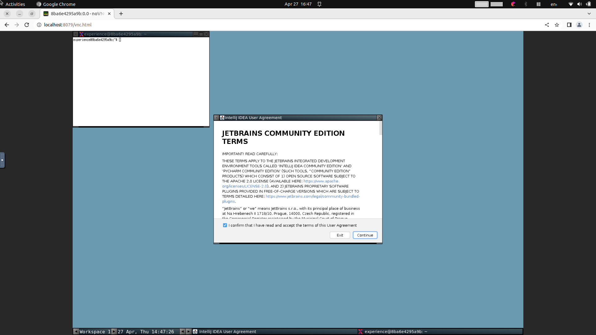
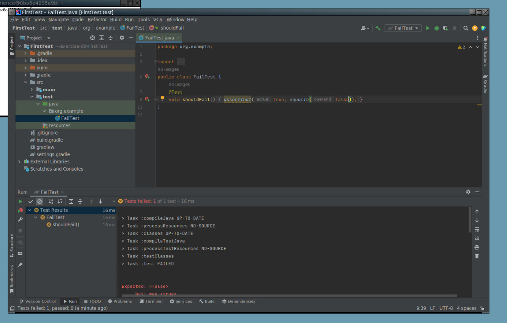

## The Distributed Ensemble - code together in a browser

Container setup to program together apart, in the browser.

## Why

Ensemble and pair programming are productive ways to develop while
conversing and learning together.

Spontaneous sessions or training incur friction to get started. We want
to start programming as soon as possible, with as little set-up by
participants as possible.

We also want to be able to see each others' actions (e.g. where the cursor is, what files they are working on, how are they carrying out an automated refactoring or writing a commit comment) while working, with little friction when switching from watching to writing.

## Use it for

### Distributed ensemble programming

### Socially distant pair programming

### Pair or ensemble programming job interviews

### Reproducible developer desktops 

This lowers the time to get set-up, as well as to do experiments. Do architectural spikes, or try out new versions of your IDE or experimental plugins.

### Training courses

At QWAN we use a more elaborate version of this to host online and
in-person training classes where participants work in pairs. This set-up
allows us full control over the contents of the participants
environment, where participants can work with minimal friction. When it
comes time to debrief, participants can explain their workings while
walking through their code on a projector or in a single screen-sharing
session.

## Installation

We encourage you to read the docker files to understand how it works,
and tailor it to your needs. Requires `docker-compose`, `docker` and `bash`.

Build the base image:

``` sh
cd desktop-base
./build.sh
```

This yields a docker image tagged `qwan/desktop`.

## Usage

The distributed-ensemble script allows you to develop locally, while running
the environment in the browser.

Example for the java version 

``` sh
cd exercises/java/ \$
../../distributed-ensemble java-intellij
```

Changing directory is intentional, so that you can use exercises outside this repository to work on, for instance when developing a new exercise.

The script builds the dockerfile in the specified directory, e.g. `java-intellij`. We do this instead of using an image to keep building this simple. After building, it starts a docker container with a webserver. Open a chrome-based browser on [http://localhost:8079/vnc.html](http://localhost:8079/vnc.html]) and you should see a webpage with a 'Connect' button. Click that button, and you have a linux desktop in a browser tab.



After agreeing the terms and conditions, you can create a new project, or write your first test in the sample project. Open `/home/experience/exercise-dir/FirstTest`. And you should see a project, with `FirstTest` inside the `test` folder. Running the test should produce a failure.


  
A test failure is progress. Happy hacking!

## How does it work

This runs Docker on a host with a browser based VNC client. A hierarchy of images,
with a generic desktop that we extended in `desktop-base` and a specific one per language. We have included
the java one to start with in `java-intellij`

# Credits

Based on [docker-novnc](https://github.com/theasp/docker-novnc) by [Andrew Philips](https://github.com/theasp).
That repository also explains what components are used and available environement variables.

Thanks to Emily Bache and Clare Sudbery for suggesting to open source it.

Initial development: Willem van den Ende, Rob Westgeest and Marc Evers @QWAN.

# Pain points

## Mac keyboard support is not great

Be mindful to use e.g. ctrl where you'd otherwise use 'Command'

## Environment occasionally freezes or becomes unresponsive to control keys. 

Sometimes toggling the control etc. keys in the browser helps, but occasionally the container needs restarting. This is pretty fast though, so not too bad.
